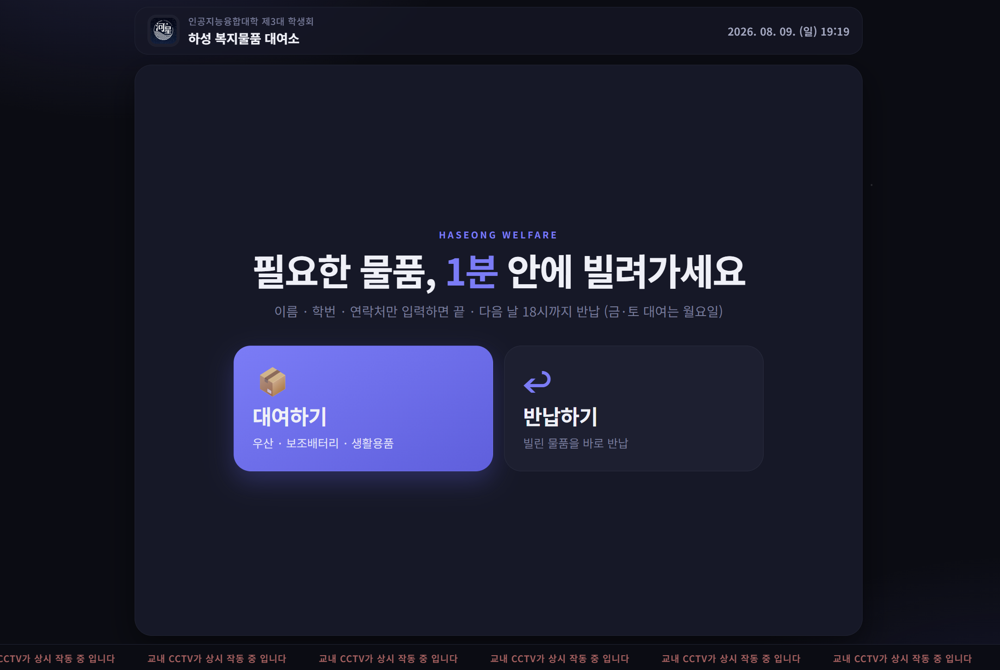
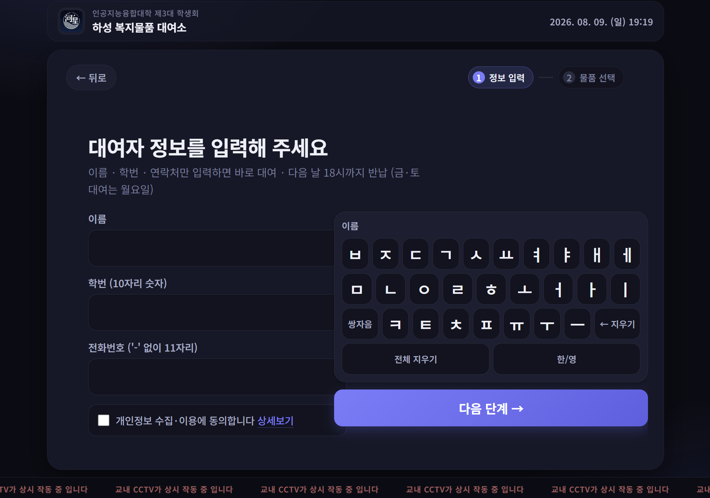
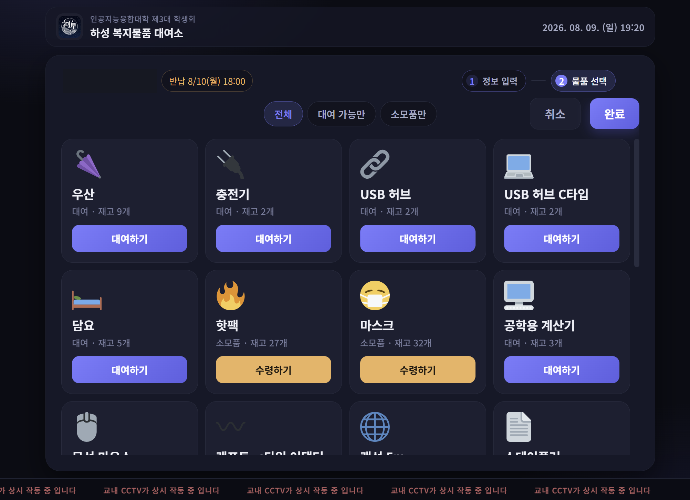
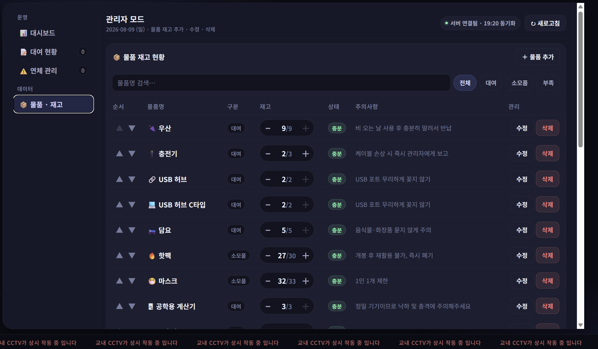

# 📦 하성 복지물품 대여소 (Haseong Welfare Kiosk)

> **인공지능융합대학 학생회를 위한 실시간 복지물품 대여 · 재고 관리 키오스크 Web App (PWA)**
>
> 🔗 **Live Demo**: [https://noeyeas.github.io/hasung-welfare-kiosk/](https://noeyeas.github.io/hasung-welfare-kiosk/)

---

## 📌 1. 프로젝트 개요 (Overview)

- **개발 기간**: 2026.01 ~ 2026.08 (운영 중)
- **배경 및 목적**: 기존 수기 장부 방식의 복지물품 대여 절차를 간소화하고, 1분 내 대여/반납 프로세스 구축 및 연체·재고 관리의 효율성을 증대하기 위해 개발했습니다.

  기존 방식에서는 대여 1건마다 이름·학번·연락처·물품·반납 기한을 손으로 적고, 반납 때 그 줄을 다시 찾아 지워야 했습니다. 그러다 보니
  **① 대여 대기 줄이 길어지고, ② 반납 기한을 사람이 계산해 연체가 누락되며, ③ 장부와 실제 재고가 어긋나고, ④ 집행부가 바뀌면 기록이 끊기는** 문제가 반복됐습니다.
  이 네 가지를 각각 *터치 입력 · 기한 자동 계산 · 서버측 재고 증감 · 시트 기반 영구 기록* 으로 풀었습니다.

- **주요 타겟**: 인공지능융합대학 재학생 및 학생회 집행부
- **운영 환경**: 학생회실에 상시 거치된 태블릿(Galaxy Tab A 10.1) 1대에서 PWA로 실행

### 📊 운영 성과 (2026.06.01 ~ 06.29, 1학기 기말 4주간)

| 지표 | 수치 |
| :--- | :--- |
| 누적 이용 세션 | **147건** |
| 고유 이용 학생 | **42명** (학번 중복 제거) |
| 운영 품목 | **23종** (대여 16 · 소모품 7) |
| 최다 이용 물품 | 우산 · 충전기 · 공학용 계산기 · 담요 · 농구공 |

수기 장부에서는 대여 1건마다 이름·학번·연락처·물품·기한을 손으로 적고 반납 시 다시 찾아 지워야 했지만,
키오스크 도입 후에는 **터치 입력만으로 1분 내 처리**되고 연체 판정·재고 차감이 자동화됐습니다.

---

## 🖼️ 2. 실행 화면 (Screenshots)

| 메인 화면 | 정보 입력 (커스텀 한글 키패드) |
| :---: | :---: |
|  |  |
| 대여 / 반납 두 갈래로 시작 | 브라우저 IME 없이 자체 키패드로 입력 |

| 물품 선택 | 관리자 콘솔 (물품·재고) |
| :---: | :---: |
|  |  |
| 대여용·소모품 구분, 실시간 재고 표시 | 재고 증감, 순서 변경, 수정/삭제 |

---

## ✨ 3. 핵심 기능 (Key Features)

### 👤 사용자 (대여자)

- **초스피드 대여/반납**: 이름 / 학번 / 연락처 입력만으로 1분 이내 대여 완료
- **키오스크 맞춤 UI**: 자체 제작 한글·숫자 가상 키패드로 디바이스 독립적 입력 지원
- **약관 동의 및 개인정보 보호**: 수집 주체·목적·저장 위치를 명시하고, 대여 기록은 반납 시 파기 / 이용 로그는 건수 상한 초과 시 오래된 것부터 자동 삭제됨을 구분해 고지
- **오프라인 내성**: 네트워크가 끊겨도 대여/반납이 접수되고, 복구 시 자동 재전송
- **대여용 / 소모품 구분**: 소모품은 "수령하기"로 반납 없이 차감, 대여용만 반납 대상
- **물품별 주의사항 노출**: 우산 건조, 계산기 취급 등 반납 분쟁을 줄이는 안내 문구 표시
- **1인 1물품 제한**: 미반납 물품이 있으면 추가 대여를 서버가 차단

### 🛡️ 관리자 (학생회)

- **실시간 현황 대시보드**: 누적 대여, 현재 대여 중, 연체 인원, 오늘 반납 수량을 한눈에 파악
- **재고 및 품목 관리**: 물품 추가/수정/삭제/순서 변경, `현재/최대` 재고 표기와 부족 필터
- **연체자 관리**: 미반납 건 추적, 연체 일수와 벌금(1일 2,000원) 자동 계산
- **변경 이력**: 재고·품목 변경 로그와 관리자 로그인 기록 보관
- **동기화 상태 표시**: 서버 연결 여부와 마지막 동기화 시각을 상단에 노출
- **비밀번호 인증**: SHA-256 해시 기반 서버 검증 (미설정 시 관리자 액션 전면 거부)

---

## 🛠️ 4. 기술 스택 (Tech Stack)

| 구분 | 기술 스택 |
| :--- | :--- |
| **Frontend** | HTML5, CSS3, JavaScript (Vanilla, ES6+) |
| **App Platform** | PWA (Service Worker, Web App Manifest), LocalStorage 캐시 |
| **Backend** | Google Apps Script (Web App API) + Google Sheets |
| **Deployment** | GitHub Pages (프론트), Apps Script 배포 (백엔드) |
| **Tools** | Git, GitHub, Claude AI (프로토타이핑 & 리팩터링) |

---

## 📐 5. 서비스 아키텍처 & 플로우 (Architecture & Flow)

```
[태블릿 키오스크 · PWA]
        │  터치 입력 → 유효성 검증 → 낙관적 UI 업데이트
        ▼
[LocalStorage 캐시 + pendingWrites 재시도 큐]
        │  fetch (API Key)          ▲
        ▼                           │ 실패 시 지수 백오프 재시도
[Google Apps Script Web App]        │
        │  액션별 rate limit · 서버측 재고 ±1 · 관리자 해시 검증
        ▼
[Google Sheets: 물품 / 대여기록 / 변경로그]
```

**파일 구조**

```
복지물품/
├── index.html            # 메인 화면 (사용자 + 관리자 진입점)
├── css/styles.css        # 사용자 화면 스타일
├── css/admin-console.css # 관리자 콘솔 스타일
├── js/script.js          # 앱 로직 (원본, 빌드 단계 없음)
├── service-worker.js     # 오프라인 캐시
├── manifest.json         # PWA 매니페스트
└── google-apps-script.js # 백엔드 (Apps Script에 붙여넣어 배포)
```

---

### 왜 이 구조인가 (설계 의사결정)

| 결정 | 이유 |
| :--- | :--- |
| **DB 대신 Google Sheets** | 운영 주체가 매년 바뀌는 학생회입니다. 개발자가 없는 학기에도 집행부가 스프레드시트를 직접 열어 재고를 고치고 기록을 확인할 수 있어야 했습니다. 별도 서버 비용·계정도 필요 없습니다. |
| **서버 대신 Apps Script** | 시트와 같은 계정 안에서 돌아 인증 연동이 필요 없고, 무료로 상시 운영됩니다. 트래픽이 태블릿 1대 분량이라 성능 요구가 낮은 점도 맞아떨어졌습니다. |
| **SPA 대신 단일 HTML** | 빌드 없이 GitHub Pages 에 올리면 끝이라, 인수인계받은 사람이 배포 파이프라인을 몰라도 수정·반영이 가능합니다. (Vue 재작성본을 시도했다가 이 이유로 접었습니다) |
| **정보 입력 → 물품 선택 2단계** | 학번을 먼저 받아야 *1인 1물품* 위반과 미반납 이력을 물품 고르기 **전에** 걸러낼 수 있습니다. 순서를 반대로 하면 다 고른 뒤 거절당해 대기 줄이 밀립니다. |
| **중복 키 = (학번, 물품명)** | 대여 시각을 키에 넣으면 통신 지연으로 재전송된 요청이 별건으로 쌓입니다. 시각을 빼서 클라이언트와 서버가 같은 규칙으로 중복을 판정하게 했습니다. |
| **재고를 절대값이 아닌 ±1 로 전송** | API 키가 정적 사이트에 노출되는 구조라, 클라이언트가 계산한 최종 재고를 신뢰할 수 없었습니다. |

### 데이터 모델 (Google Sheets)

| 시트 | 역할 | 주요 컬럼 |
| :--- | :--- | :--- |
| `items` | 품목 마스터 | `name`, `type`(대여/소모품), `stock`, `maxStock`, `notice`, `icon` |
| `borrowed` | 미반납 대여 건 (반납 시 행 삭제) | `studentId`, `name`, `phone`, `itemName`, `dueDate`, `borrowedAt` |
| `changeLog` | 대여·반납·재고·품목 변경 이력 | `action`, `details`, `time` |
| `loginLog` | 키오스크 이용 기록 | `studentId`, `name`, `phone`, `time` |
| `stats` | 누적 카운터 | `key`, `value` |

`maxStock` 은 "원래 있어야 할 수량"이라 `stock/maxStock` 을 비교해 재고 부족을 자동 판정합니다.
`borrowed` 는 미반납 건만 남기므로 연체 조회가 곧 이 시트의 필터링이고, 이력은 `changeLog` 가 따로 보존합니다.
개인정보(이름·연락처)는 `borrowed` 와 `loginLog` 에만 존재하며, 전자는 반납 시 행 삭제로 파기되고
후자는 상한(로그인 1,000건 · 변경 2,000건)을 넘으면 오래된 행부터 자동 삭제됩니다.

---

## 💡 6. 기술적 도전 및 문제 해결 (Troubleshooting & Key Learnings)

### 1) 키오스크 환경에 최적화된 터치 키패드 UI 구현

- **문제**: 물리 키보드가 없는 태블릿 환경에서 브라우저 기본 가상 키보드 호출 시 레이아웃이 깨지고, 한글 입력 시 조합 이벤트 처리가 불안정했습니다.
- **해결**: 자체 한글·숫자 키패드 컴포넌트를 설계해 브라우저 IME에 의존하지 않는 입력 흐름을 만들었고, 디바이스와 무관하게 동일한 UX를 제공하도록 했습니다.

### 2) 실시간 재고 및 연체 상태 추적 로직

- **문제**: 반납 기한(다음 날 18시, 주말 대여 건은 월요일)을 수작업으로 계산하다 보니 연체 판정이 자주 누락됐습니다.
- **해결**: 대여 일시 기준 반납 기한 자동 계산 알고리즘을 구현해 연체 데이터를 실시간으로 분류하도록 개선했습니다.

### 3) 불안정한 네트워크에서의 데이터 유실 방지

- **문제**: 학생회실 Wi-Fi가 간헐적으로 끊기면 대여 요청이 그대로 사라져 장부와 실물 재고가 어긋났습니다.
- **해결**: 서버 전송 실패분을 `pendingWrites` 큐에 적재하고 지수 백오프로 재시도하도록 설계했습니다. 앱을 껐다 켜도 큐가 유지되어 이어서 전송됩니다.

### 4) 정적 사이트에 노출되는 API 키로 인한 권한 문제

- **문제**: GitHub Pages 특성상 API 키가 소스에 그대로 실려 나가, 키만 알면 재고를 임의 값으로 덮어쓸 수 있는 구조였습니다.
- **해결**: 관리자 액션과 학생 액션의 권한을 분리하고, 학생 흐름의 재고 증감은 **클라이언트가 계산한 절대값 대신 서버가 직접 ±1** 하도록 바꿨습니다. 관리자 인증은 비밀번호 해시 미설정 시 전부 거부하는 fail-closed 방식으로 전환했습니다.

### 5) 개인정보 최소 보관 원칙 적용

- **문제**: 초기 구현에서는 이름·연락처가 기기 LocalStorage에 남아 태블릿 분실 시 유출 위험이 있었습니다.
- **해결**: 개인정보는 서버로만 전송하고 기기 캐시에는 학번·물품명·기한만 남기도록 재설계했습니다. 관리자 화면의 이름·연락처는 메모리에서만 사용하고 로그아웃 시 즉시 파기합니다.

### 6) 동시 요청으로 인한 재고·기록 꼬임

- **문제**: 여러 명이 동시에 같은 물품을 대여하거나, 통신이 느려 사용자가 버튼을 두 번 누르면 재고가 음수가 되거나 대여 기록이 중복 생성됐습니다.
- **해결**: 쓰기 요청 전체를 `LockService` 로 직렬화하고, 중복 판정 키를 `(학번, 물품명)` 으로 통일해 클라이언트와 서버가 같은 규칙을 쓰도록 맞췄습니다. 반납은 멱등 처리해 중복 반납으로 재고가 부풀지 않게 하고, 재고 0 이하면 대여 자체를 거절합니다.

### 7) 비관리자 API로 새어 나가던 개인정보

- **문제**: 사용자 화면도 대여 목록을 조회해야 하는데, 응답에 이름·연락처가 그대로 실려 있었습니다.
- **해결**: 사용자 흐름은 `(학번, 물품명)` 만으로 중복 대여·반납 판정이 가능하다는 점에 착안해, 비관리자 응답에서 이름·전화번호를 서버가 제거(`sanitizeBorrowed`)하도록 했습니다. 이름·연락처는 관리자 인증을 통과한 `getAllAdmin` 에서만 내려갑니다. 더불어 액션별 rate limit과 출력 시 HTML 이스케이프를 적용했습니다.

### 권한 구분

| 액션 | 관리자 인증 |
| :--- | :--- |
| `getAllAdmin`, `upsertItem`, `deleteItem`, `reorderItems`, `updateStock` | 필요 |
| `addBorrowed`, `removeBorrowed`, `recordConsume`, `addChangeLog`, `addLoginLog` | 불필요 (입력 검증 + 액션별 rate limit) |

---

## 🚀 7. 실행 방법 (Getting Started)

```bash
# 클론하기
git clone https://github.com/noeyeas/hasung-welfare-kiosk.git

# 폴더 이동
cd hasung-welfare-kiosk

# index.html을 브라우저로 실행 (PWA 설치는 HTTPS 또는 localhost 필요)
```

### 앱 설치 (PWA)

| 환경 | 설치 방법 |
| :--- | :--- |
| **Android** | Chrome → 우측 상단 `⋮` → "홈 화면에 추가" / "앱 설치" |
| **iOS** | Safari → 하단 공유 버튼 `□↑` → "홈 화면에 추가" |
| **Desktop** | Chrome/Edge → 주소창 오른쪽 설치 아이콘 `⊕` 클릭 |

### 백엔드 배포 시 필수 설정

> **`ADMIN_PASSWORD_HASH` 를 반드시 설정해야 합니다.**
>
> Apps Script 편집기 → 프로젝트 설정 → 스크립트 속성에 아래 두 값을 넣으세요.
>
> | 속성 | 값 | 미설정 시 |
> | :--- | :--- | :--- |
> | `ADMIN_PASSWORD_HASH` | 관리자 비밀번호의 SHA-256 hex | 관리자 화면에서 `Admin auth not configured` 오류 |
> | `SPREADSHEET_ID` | 데이터 시트의 스프레드시트 ID | 모든 시트 접근이 예외로 실패 |
>
> 시트에는 학생 실명·학번·연락처가 저장되므로 **ID 를 저장소에 두지 않고**,
> 시트 자체도 링크 공유를 끈 채 소유자만 접근하도록 유지합니다.

```bash
# 해시 만드는 법
printf '내비밀번호' | sha256sum
```

기존 시트를 쓰던 경우 편집기에서 `backfillMaxStock()` 을 한 번 실행하세요.
`maxStock` 이 비어 있으면 재고 부족 경고가 뜨지 않습니다.
시트 ID·API 키 등 나머지 설정값도 스크립트 속성에 저장하며, 항목은 `google-apps-script.js` 상단 주석을 참고하세요.

---

## ⚠️ 8. 유지보수 노트 (Maintenance Notes)

### `js/script.js` 가 원본입니다

과거 Babel로 ES5 트랜스파일된 결과물이지만 **트랜스파일 이전 원본은 남아 있지 않습니다.**
따라서 지금은 `js/script.js` 자체가 유일한 원본이며 직접 수정합니다. 빌드 단계는 없습니다.
`_regenerator` / `_asyncToGenerator` 로 시작하는 상태 머신 코드가 보이는 것은 그 때문이며,
새로 작성하는 부분은 일반적인 문법으로 쓰면 됩니다.

### 캐시 버전 올리기

`js/script.js` 나 `css/styles.css` 를 수정했다면 `index.html` 의 `?v=` 값을,
`service-worker.js` 를 수정했다면 `CACHE_NAME` 의 버전을 올려야 기기에 반영됩니다.
서비스 워커가 `js/script.js` 를 쿼리 없이 미리 캐시하므로, 스크립트를 고쳤다면
`?v=` 와 `CACHE_NAME` 을 **함께** 올리는 편이 안전합니다.

### 로컬 스모크 테스트

`node .claude/smoke-test.js` 로 `js/script.js` 를 최소 DOM 스텁 위에서 실행해 볼 수 있습니다.
참조 오류·초기화 순서 문제, 대여/반납 요청의 서버 전송 여부, 재시도 큐 동작,
개인정보가 LocalStorage 에 남지 않는지를 확인합니다. (`.claude/` 는 배포에 포함되지 않습니다)

### 대상 기기

운영 기기는 **Galaxy Tab A 10.1 (SM-P580, 2016)** 이며 Chrome 106 기준으로 동작을 확인했습니다.
`Proxy`(Chrome 49+), `async`/`await`(Chrome 55+) 등이 모두 지원되므로 문법 제약은 없습니다.
(Android 7.x는 Chrome 120 전후까지만 업데이트됩니다)

> Vue 3 재작성본(`hasung-kiosk-v2/`)은 미배포 상태로 방치돼 어느 쪽이 원본인지
> 혼동을 주어 삭제했습니다. 필요하면 git 이력에서 되살릴 수 있습니다.
